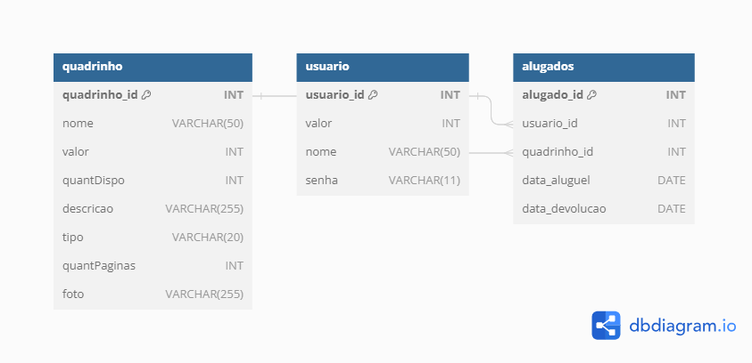

# Quadrinhos Online

## Introdução

Este documento descreve o projeto de um sistema web de aluguel de quadrinhos, que tem como objetivo permitir que pessoas que não têm muito dinheiro possam ler e se divertir com histórias em quadrinhos. O sistema será desenvolvido usando Angular e MySQL, seguindo as boas práticas de engenharia de software.

## Objetivo

O objetivo deste projeto é desenvolver um sistema web de aluguel de quadrinhos, que ofereça aos usuários uma forma fácil, rápida e barata de acessar e ler quadrinhos de diversos gêneros e autores. O sistema também deve permitir que o administrador gerencie o estoque de quadrinhos, adicione ou remova quadrinhos, e gere relatórios sobre o desempenho do sistema.

## Escopo

O escopo deste projeto é limitado ao desenvolvimento do sistema web de aluguel de quadrinhos, que consiste em uma interface gráfica para o usuário e o administrador, e uma camada de persistência de dados. O sistema não inclui a aquisição, a distribuição ou a devolução física dos quadrinhos, nem a integração com sistemas de pagamento externos.

## Usuários

Os usuários do sistema são:

- Usuário: É o cliente que deseja alugar quadrinhos para ler e se divertir. Ele precisa de uma forma fácil e barata de acessar e ler quadrinhos de seu interesse, e de uma forma segura e confiável de pagar pelo aluguel.
- Administrador: É o responsável pelo gerenciamento do sistema, que inclui o cadastro, a remoção e a atualização dos quadrinhos disponíveis, e a geração de relatórios sobre o funcionamento do sistema. Ele precisa de uma forma simples e eficiente de administrar o estoque de quadrinhos, e de uma forma precisa e transparente de acompanhar o desempenho do sistema.

## Requisitos

### Requisitos Funcionais

Os requisitos funcionais do sistema são:

- RF01: O sistema deve permitir que o usuário se cadastre e faça login, informando seu nome, e-mail e senha.
- RF02: O sistema deve permitir que o usuário adicione dinheiro à sua conta, informando o valor e o método de pagamento.
- RF03: O sistema deve permitir que o usuário retire dinheiro de sua conta, informando o valor e o método de pagamento.
- RF04: O sistema deve permitir que o usuário consulte o catálogo de quadrinhos disponíveis, filtrando por gênero, autor, título, etc.
- RF05: O sistema deve permitir que o usuário alugue um quadrinho, informando o tempo de aluguel e confirmando a operação.
- RF06: O sistema deve permitir que o usuário devolva um quadrinho, pagando a taxa correspondente ao tempo de aluguel e recebendo um comprovante.
- RF07: O sistema deve permitir que o administrador faça login, informando seu nome de usuário e senha.
- RF08: O sistema deve permitir que o administrador adicione um quadrinho ao estoque, informando os dados do quadrinho, como título, autor, gênero, preço, etc.
- RF09: O sistema deve permitir que o administrador remova um quadrinho do estoque, informando o título do quadrinho.
- RF10: O sistema deve permitir que o administrador atualize os dados de um quadrinho, informando o título do quadrinho e os novos dados.
- RF11: O sistema deve permitir que o administrador consulte os quadrinhos alugados, filtrando por usuário, data, tempo, etc.
- RF12: O sistema deve permitir que o administrador gere relatórios sobre o desempenho do sistema, como o número de aluguéis, a receita, os quadrinhos mais populares, etc.

### Requisitos Não Funcionais

Os requisitos não funcionais do sistema são:

- RNF01: O sistema deve ser desenvolvido usando Angular como framework de frontend, e MySQL como banco de dados.
- RNF02: O sistema deve seguir o padrão MVC (Model-View-Controller) de arquitetura de software, separando as camadas de apresentação, lógica e persistência de dados.
- RNF03: O sistema deve ser responsivo, adaptando-se a diferentes tamanhos e resoluções de tela.
- RNF04: O sistema deve ser rápido, respondendo às requisições do usuário em no máximo 5 segundos.
- RNF05: O sistema deve ser fácil de usar, oferecendo uma interface gráfica intuitiva e amigável, com menus, botões, ícones e mensagens claras e consistentes.
- RNF06: O sistema deve ser seguro, protegendo os dados dos usuários e do administrador, e evitando fraudes, ataques e invasões.
- RNF07: O sistema deve ser confiável, garantindo a disponibilidade, a integridade e a consistência dos dados, e evitando falhas, erros e perdas de informação.

## Arquitetura

A arquitetura do sistema é baseada no padrão MVC (Model-View-Controller), que divide o sistema em três camadas: apresentação, lógica e persistência de dados.

### Camada de Apresentação

A camada de apresentação é responsável por interagir com o usuário, exibindo as informações e recebendo as entradas. Ela é composta por duas interfaces gráficas: uma para o usuário e outra para o administrador. As interfaces são desenvolvidas usando Angular, um framework de frontend que facilita a criação de aplicações web dinâmicas e responsivas.

### Diagrama UML
<h1 align="center">
  
</h1>

### Camada de Lógica

A camada de lógica é responsável por implementar as regras de negócio e as funcionalidades do sistema. Ela é composta por um conjunto de controladores, que recebem as requisições da camada de apresentação, processam os dados e retornam as respostas. Os controladores são desenvolvidos usando Node.js, uma plataforma de execução de código JavaScript no lado do servidor, que permite uma comunicação rápida e eficiente com o banco de dados.

### Camada de Persistência de Dados

A camada de persistência de dados é responsável por armazenar e recuperar os dados do sistema. Ela é composta por um banco de dados relacional, que organiza os dados em tabelas e relacionamentos. O banco de dados é desenvolvido usando MySQL, um sistema de gerenciamento de banco de dados de código aberto, que oferece um alto desempenho, uma boa segurança e uma fácil administração.

## Ferramentas

As ferramentas utilizadas para o desenvolvimento do sistema são:

- Angular: Um framework de frontend que facilita a criação de aplicações web dinâmicas e
responsivas.
- Node.js: Uma plataforma de execução de código JavaScript no lado do servidor, que
permite uma comunicação rápida e eficiente com o banco de dados.
- MySQL: Um sistema de gerenciamento de banco de dados de código aberto, que oferece
um alto desempenho, uma boa segurança e uma fácil administração.
- GitHub: Uma plataforma de hospedagem de código-fonte e de colaboração entre desenvolvedores, que permite o versionamento, o controle e o compartilhamento do código, além de oferecer recursos como issues, pull requests e branches.
- GitFlow: Um modelo de fluxo de trabalho baseado em git, que define um conjunto de regras e boas práticas para o gerenciamento de branches, commits e merges, facilitando o desenvolvimento paralelo e a integração contínua do código.
